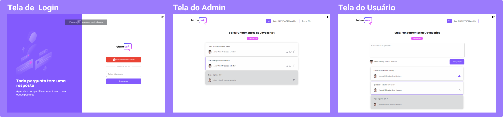
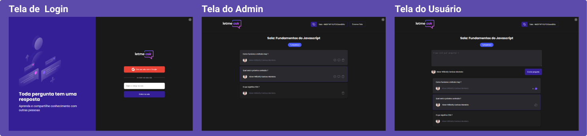
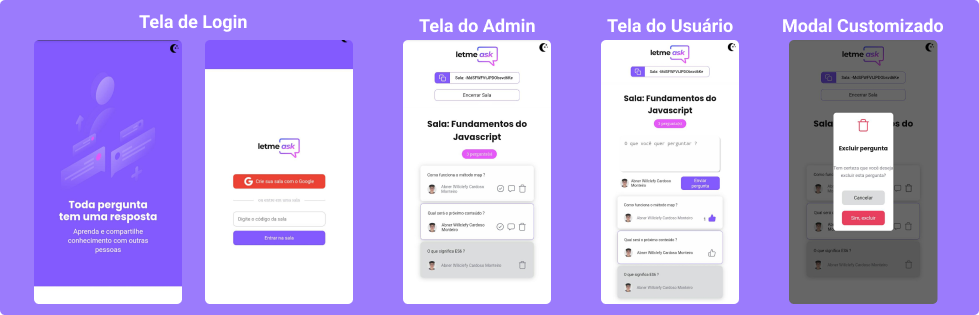
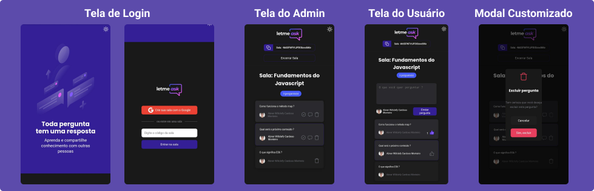

<h3 align="center"></h3>

  

  
  
  
    
   
  

---

 Crie e compartilhe salas de perguntas e respostas em tempo real
      

## 🧐 Sobre o projeto 

Este projeto foi desenvolvido durante a NLW#6 e tem como objetivo hospedar salas em tempo real para compartilhar perguntas e respostas direcionadas a streamers

## 🎨 Layout

### Telas Desktop

  

  
  
  

### Telas Mobile

  

  
  
  

# :video_game: Link para o projeto 
## :point_right: [Letmeask](https://letmeask-3c3ab.web.app)

## ✏️ Utilidades

- Autenticação com conta do Google
- Criar sala
- Entrar em sala existente
- Criar perguntas
- Curtir perguntas
- Apagar perguntas
- Dar destaque a uma pergunta
- Marcar pergunta como respondida
- Encerrar sala

## ⚙️ Funcionalidades extras
- Tema escuro
- Tela Mobile
- Organizar perguntas por:
  - Numero de likes
  - Em destaque
  - Respondidas
- Modais de confirmação customizados

## 🚀 Tecnologias utilizadas 

- <code></code>
- <code></code>
- 🔥 Firebase

## 🎉 Conhecimentos Adquiridos

- React Hooks
- Context API
- React Router DOM
- Styled Components
- Firebase - Realtime Database

## 🌟 Autor 🌟

- [@AbnerWillclefy](https://github.com/AbnerWillclefy)

